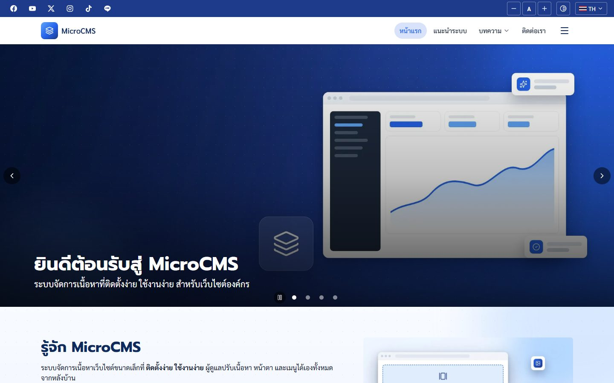
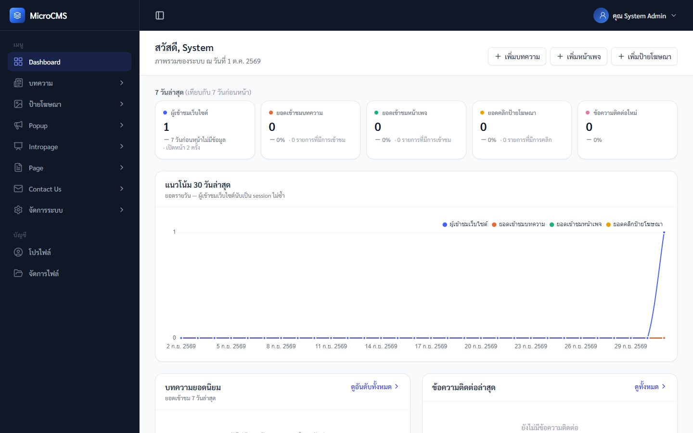

# MicroCMS

ระบบจัดการเนื้อหาเว็บไซต์ (CMS) ขนาดเล็กที่เน้น **ติดตั้งง่าย ใช้งานง่าย** สำหรับเว็บไซต์องค์กร/หน่วยงาน
ผู้ดูแลจัดการเนื้อหา หน้าตา และเมนูได้เองทั้งหมดจากหลังบ้าน รองรับภาษาไทย/อังกฤษ



## สารบัญ

1. [ภาพรวมและสภาพแวดล้อมของระบบ](#1-ภาพรวมและสภาพแวดล้อมของระบบ)
2. [สิ่งที่ต้องเตรียมก่อนติดตั้ง](#2-สิ่งที่ต้องเตรียมก่อนติดตั้ง)
3. [วิธีติดตั้ง](#3-วิธีติดตั้ง)
   - [3.1 ติดตั้งบน server เอง (Ubuntu)](#31-ติดตั้งบน-server-เอง-ubuntu-2404)
   - [3.2 ติดตั้งด้วย Docker](#32-ติดตั้งด้วย-docker)
   - [3.3 ติดตั้งบน Kubernetes](#33-ติดตั้งบน-kubernetes)
   - [3.4 เครื่องนักพัฒนา](#34-เครื่องนักพัฒนา)
4. [แยก MySQL และ Redis ออกจากเครื่องเว็บ (แนะนำ)](#4-แยก-mysql-และ-redis-ออกจากเครื่องเว็บ-แนะนำ)
5. [ค่าใน .env](#5-ค่าใน-env)
6. [งานเบื้องหลัง (scheduler / jobs)](#6-งานเบื้องหลัง-scheduler--jobs)
7. [การเข้าใช้งานหลังบ้าน](#7-การเข้าใช้งานหลังบ้าน)
8. [การอัปเดตเวอร์ชัน](#8-การอัปเดตเวอร์ชัน)
9. [การสำรองข้อมูล](#9-การสำรองข้อมูล)
10. [ความปลอดภัยก่อนเปิดใช้งานจริง](#10-ความปลอดภัยก่อนเปิดใช้งานจริง)
11. [แก้ปัญหาที่พบบ่อย](#11-แก้ปัญหาที่พบบ่อย)
12. [เอกสารอื่น](#12-เอกสารอื่น)
13. [สัญญาอนุญาต](#13-สัญญาอนุญาต)

---

## 1. ภาพรวมและสภาพแวดล้อมของระบบ

### ความสามารถ

| ส่วน | รายละเอียด |
|-----|-----------|
| บทความ | หมวดหมู่ แท็ก เนื้อหาหลายส่วน (ข้อความ รูปภาพ กลุ่มรูป 7 รูปแบบ วิดีโอ เอกสาร) รายงานยอดเข้าชม |
| หน้าเพจ | จัดโครงสร้างเองแบบแถว → คอลัมน์ → widget (Slideshow, Slideset, Grid, Custom Text) |
| ป้ายโฆษณา / Intropage / Popup | กำหนดช่วงเวลาเผยแพร่ นับคลิกป้ายโฆษณา |
| ติดต่อเรา | ข้อมูลติดต่อ แผนที่ แบบฟอร์มที่ป้องกันสแปมด้วย Cloudflare Turnstile |
| จัดการระบบ | ผู้ใช้งาน กลุ่มและสิทธิ์รายโมดูล เมนูหน้าบ้าน Template คลังไฟล์ ตั้งค่าระบบ ประวัติการใช้งาน ตรวจสอบ Error |
| หน้าบ้าน | 2 ภาษา, SEO (meta/hreflang/JSON-LD), `sitemap.xml`/`robots.txt` อัตโนมัติ, เครื่องมือการเข้าถึง (WCAG), รูปย่อ + WebP อัตโนมัติ |

### สถาปัตยกรรม

```
ผู้ใช้ ──HTTPS──▶ reverse proxy / load balancer / ingress (ทำ HTTPS)
                     │
                     ▼
               nginx ──▶ PHP-FPM (Laravel 12)  ──▶  MySQL 8   (ข้อมูลทั้งหมด)
                                 │              ──▶  Redis     (session, cache, คิวยอดเข้าชม)
                                 └──▶ storage/  (ไฟล์ที่อัปโหลด, รูปย่อ, log)
               scheduler (php artisan schedule:run ทุกนาที) ── บันทึกยอดเข้าชมจาก Redis ลง MySQL
```

### ความต้องการของระบบ

| ส่วน | เวอร์ชัน | หมายเหตุ |
|-----|---------|---------|
| PHP | **8.2 ขึ้นไป** (ทดสอบ 8.2 และ 8.3) | ใช้กับ PHP-FPM — `php artisan serve` รับได้ทีละ request ห้ามใช้เปิดบริการจริง |
| PHP extensions | `gd` (JPEG/PNG/WebP), `pdo_mysql`, `mbstring`, `xml`, `curl`, `zip`, `intl`, `bcmath`, **`opcache`** | ไม่เปิด OPcache ช้าลงราว 20 เท่า (~1 วินาทีต่อหน้า) |
| MySQL | **8.0 ขึ้นไป** (ทดสอบ 8.0, 8.4) | `utf8mb4` |
| Redis | 6 ขึ้นไป (ทดสอบ 7) | ใช้ client `predis` (PHP) — ไม่ต้องติดตั้ง extension `redis` |
| Web server | nginx (มีไฟล์ตั้งค่าให้) | Apache ใช้ได้ผ่าน `public/.htaccess` (ต้องเปิด `mod_rewrite`) |
| Composer | 2.x | |
| Node.js | 20 ขึ้นไป | ใช้แค่ตอน build หน้าเว็บ (`npm run build`) ไม่ต้องมีบนเครื่องที่รันจริงถ้า build จากที่อื่น |
| หน่วยความจำ | 1 GB ขั้นต่ำ, 2 GB ขึ้นไปแนะนำ | สำหรับเว็บ + MySQL + Redis บนเครื่องเดียว |
| พื้นที่ดิสก์ | ตามปริมาณไฟล์ | รูปที่อัปโหลดมีรูปย่อหลายขนาด + WebP เพิ่มราว 50–100% ของขนาดต้นฉบับ |

ขนาดไฟล์ที่อัปโหลดได้สูงสุด 5 MB ต่อไฟล์ (โมดูลจัดการไฟล์) — PHP/nginx ในไฟล์ตั้งค่าที่ให้มารับ request ได้ถึง 25 MB

### ข้อมูลที่ต้องเก็บถาวร

| ข้อมูล | ที่อยู่ | สำรอง? |
|-------|-------|-------|
| ฐานข้อมูล | MySQL | ✅ จำเป็น |
| ไฟล์ที่อัปโหลด + รูปย่อ | `storage/app/private/` | ✅ จำเป็น (รูปย่อสร้างใหม่ได้ด้วย `php artisan files:thumbnails`) |
| `APP_KEY` | `.env` / secret | ✅ จำเป็น — ใช้ถอดรหัสค่าลับในตั้งค่าระบบ |
| log | `storage/logs/` | ไม่จำเป็น (หน้า "ตรวจสอบ Error" อ่านจากไฟล์นี้) |
| Redis | — | ไม่จำเป็น (หายแล้วผู้ใช้ต้อง login ใหม่ + ยอดเข้าชมที่ยังไม่บันทึกหาย) |

---

## 2. สิ่งที่ต้องเตรียมก่อนติดตั้ง

- [ ] **โดเมนจริงที่จะใช้** — ตัดสินใจก่อนว่าใช้ `https://www.example.com` หรือ `https://example.com` แล้วตั้ง `APP_URL` ให้ตรงทุกตัวอักษร
      (ระบบในโหมด production รับเฉพาะ Host ของ `APP_URL` และ subdomain — เปิดด้วยชื่ออื่น/IP จะได้ **400 Bad Request**)
- [ ] **HTTPS** — ใบรับรองจาก Let's Encrypt (certbot), Cloudflare หรือ load balancer/ingress
- [ ] **ฐานข้อมูล MySQL** — ชื่อฐานข้อมูล, ผู้ใช้, รหัสผ่าน (สร้างเปล่าไว้ ระบบสร้างตารางเอง)
- [ ] **Redis** — host, port, รหัสผ่าน
- [ ] **`APP_KEY`** — สร้างครั้งเดียวตอนติดตั้ง แล้ว**เก็บไว้ตลอด** (ย้ายเครื่อง/ติดตั้งใหม่ต้องใช้ค่าเดิม — ค่าใหม่ทำให้รหัสผ่าน SMTP / Turnstile secret
      ที่บันทึกไว้อ่านไม่ได้ ต้องกรอกใหม่ และผู้ใช้ทุกคนหลุดจากระบบ)
- [ ] (ภายหลังได้) บัญชี SMTP สำหรับส่งอีเมล, คีย์ Cloudflare Turnstile, Google Analytics, Google Maps API key —
      วิธีขอแต่ละค่ามีในบทความหมวด "การตั้งค่าบริการภายนอก" ของข้อมูลตัวอย่าง

---

## 3. วิธีติดตั้ง

ทุกวิธีจบด้วยบัญชีผู้ดูแล `admin@microcms.com` / `P@ssw0rd` (เปลี่ยนทันทีหลังเข้าสู่ระบบ — ดู [หัวข้อ 7](#7-การเข้าใช้งานหลังบ้าน))
และ**ข้อมูลตัวอย่าง**ทั้งชุด (บทความ หน้าแรก เมนู template ฯลฯ — ดู [`exampledata/README.md`](exampledata/README.md))
ถ้าต้องการระบบเปล่า ให้ตั้ง `SEED_SAMPLE_DATA=false` ตอนสั่ง seed (มีตัวอย่างในแต่ละวิธี) — ระบบเปล่าหน้าแรกของเว็บจะเป็น 404
จนกว่าจะสร้างหน้าเพจ + เมนูหน้าบ้านที่ตั้ง "เป็นหน้าหลัก" (และสร้าง Template อย่างน้อย 1 รายการ)

### 3.1 ติดตั้งบน server เอง (Ubuntu 24.04)

ขั้นตอนนี้ทดสอบแล้วบน Ubuntu 24.04 (PHP 8.3, Node 20) — distro อื่นเปลี่ยนชื่อแพ็กเกจให้ตรง

**1) ติดตั้งแพ็กเกจ**

```bash
sudo apt update
sudo apt install -y nginx unzip git curl ca-certificates \
    php8.3-fpm php8.3-cli php8.3-mysql php8.3-gd php8.3-mbstring php8.3-xml php8.3-curl \
    php8.3-zip php8.3-intl php8.3-bcmath php8.3-opcache

# MySQL / Redis บนเครื่องเดียวกัน (ข้ามได้ถ้าใช้ของภายนอก — ดูหัวข้อ 4)
sudo apt install -y mysql-server redis-server

# Composer
curl -sS https://getcomposer.org/installer | sudo php -- --install-dir=/usr/local/bin --filename=composer

# Node.js 20 (สำหรับ build หน้าเว็บ)
curl -fsSL https://deb.nodesource.com/setup_20.x | sudo -E bash -
sudo apt install -y nodejs
```

**2) สร้างฐานข้อมูล**

```sql
-- sudo mysql
CREATE DATABASE microcms CHARACTER SET utf8mb4 COLLATE utf8mb4_unicode_ci;
CREATE USER 'microcms'@'localhost' IDENTIFIED BY 'รหัสผ่านที่ยาวและเดายาก';
GRANT ALL PRIVILEGES ON microcms.* TO 'microcms'@'localhost';
```

ตั้งรหัสผ่าน Redis: แก้ `/etc/redis/redis.conf` → `requirepass รหัสผ่าน` และ `maxmemory-policy noeviction` แล้ว `sudo systemctl restart redis-server`

**3) วางโค้ดและตั้งค่า**

```bash
sudo mkdir -p /var/www/microcms && sudo chown $USER /var/www/microcms
git clone https://github.com/krerkkiat7/micro-cms.git /var/www/microcms   # หรือคัดลอกไฟล์ขึ้น server
cd /var/www/microcms

cp .env.example .env
nano .env        # แก้ตามหัวข้อ 5 — อย่างน้อย APP_ENV, APP_DEBUG, APP_URL, DB_*, REDIS_PASSWORD

composer install --no-dev --optimize-autoloader
php artisan key:generate          # ครั้งแรกเท่านั้น — ย้ายเครื่องให้คัดลอก APP_KEY เดิมมาแทน
npm ci && npm run build

sudo chown -R www-data:www-data storage bootstrap/cache
```

**4) สร้างตารางและข้อมูลเริ่มต้น** — รันในนาม `www-data` (ไฟล์ตัวอย่างที่นำเข้าจะได้เป็นของ PHP-FPM)

```bash
sudo -u www-data php artisan migrate --seed --force
# ระบบเปล่าไม่เอาข้อมูลตัวอย่าง:  sudo -u www-data env SEED_SAMPLE_DATA=false php artisan migrate --seed --force

sudo -u www-data php artisan optimize     # cache config/route/view — ต้องรันใหม่ทุกครั้งที่แก้ .env หรืออัปเดตโค้ด
```

**5) PHP (OPcache) และ nginx**

```bash
# ค่าที่แนะนำ (OPcache, ขนาดอัปโหลด) — คัดลอกจากไฟล์ของ production image
sudo cp docker/production/php.ini /etc/php/8.3/fpm/conf.d/99-microcms.ini
```

> `opcache.validate_timestamps = 0` = PHP ไม่ตรวจไฟล์ที่เปลี่ยน — อัปเดตโค้ดแล้วต้อง `sudo systemctl reload php8.3-fpm` ทุกครั้ง

สร้าง `/etc/nginx/sites-available/microcms` (ดัดแปลงจาก [`docker/production/nginx.conf`](docker/production/nginx.conf)):

```nginx
server {
    listen 80;
    server_name www.example.com;
    root /var/www/microcms/public;
    index index.php;
    charset utf-8;
    client_max_body_size 25M;

    location / {
        try_files $uri $uri/ /index.php?$query_string;
    }

    location /build/ {
        expires 1y;
        add_header Cache-Control "public, immutable";
        try_files $uri =404;
    }

    location = /favicon.ico { access_log off; log_not_found off; try_files $uri /index.php?$query_string; }
    location = /robots.txt  { access_log off; log_not_found off; try_files $uri /index.php?$query_string; }

    location ~ \.php$ {
        fastcgi_pass unix:/run/php/php8.3-fpm.sock;
        fastcgi_param SCRIPT_FILENAME $realpath_root$fastcgi_script_name;
        include fastcgi_params;
        fastcgi_param HTTP_HOST $http_host;     # nginx รุ่นใหม่ตัดพอร์ตออกจาก Host — ลิงก์ผิดเมื่อใช้พอร์ตอื่น
        fastcgi_hide_header X-Powered-By;
        fastcgi_buffer_size 32k;                # จำเป็น — ไม่งั้นบางหน้าได้ 502 "upstream sent too big header"
        fastcgi_buffers 16 32k;
    }

    location ~ /\.(?!well-known).* {
        deny all;
    }
}
```

```bash
sudo ln -s /etc/nginx/sites-available/microcms /etc/nginx/sites-enabled/
sudo rm -f /etc/nginx/sites-enabled/default
sudo nginx -t && sudo systemctl reload nginx php8.3-fpm
```

**6) HTTPS**

```bash
sudo apt install -y certbot python3-certbot-nginx
sudo certbot --nginx -d www.example.com
```

แล้วตั้ง `APP_URL=https://www.example.com` และ `SESSION_SECURE_COOKIE=true` ใน `.env` → `sudo -u www-data php artisan optimize`

**7) scheduler** — ดู [หัวข้อ 6](#6-งานเบื้องหลัง-scheduler--jobs)

```bash
echo '* * * * * www-data cd /var/www/microcms && php artisan schedule:run >> /dev/null 2>&1' | sudo tee /etc/cron.d/microcms
```

### 3.2 ติดตั้งด้วย Docker

ใช้ production image จาก [`docker/production/Dockerfile`](docker/production/Dockerfile) — nginx + PHP-FPM 8.2 (OPcache) ใน image เดียว
มีโค้ด, `vendor` (ไม่มี dev) และหน้าเว็บที่ build แล้วอยู่ในตัว image เดียวกันใช้ได้หลายบทบาท:

| คำสั่ง (`command`/`args`) | หน้าที่ |
|--------------------------|--------|
| `web` (ค่าเริ่มต้น) | เปิดเว็บที่พอร์ต **8080** (cache config/route/view ให้ตอนเริ่ม) |
| `scheduler` | งานตามเวลา — รันแค่ **1 ตัว** ต่อระบบ |
| `migrate [--seed]` | สร้าง/อัปเดตตาราง |
| `artisan <คำสั่ง>` | คำสั่ง artisan อื่น ๆ (รันในนาม `www-data` ให้เอง) |

ไฟล์ที่อัปโหลดอยู่ที่ `/var/www/html/storage` → ต้อง mount เป็น volume ถาวร

**ติดตั้งบนเครื่องเดียวด้วย Docker Compose** ([`docker-compose.prod.yml`](docker-compose.prod.yml) — เว็บ + scheduler + MySQL 8.4 + Redis 7):

```bash
git clone https://github.com/krerkkiat7/micro-cms.git microcms && cd microcms
cp .env.example .env
```

แก้ `.env` (ไฟล์นี้ใช้ทั้งเป็นค่าของระบบ และรหัสผ่านตอนสร้าง MySQL/Redis):

```dotenv
APP_ENV=production
APP_DEBUG=false
APP_URL=https://www.example.com
LOG_LEVEL=warning
DB_DATABASE=microcms
DB_USERNAME=microcms
DB_PASSWORD=รหัสผ่าน-db
DB_ROOT_PASSWORD=รหัสผ่าน-root-ของ-mysql
REDIS_PASSWORD=รหัสผ่าน-redis
SESSION_SECURE_COOKIE=true
TRUSTED_PROXIES=*        # มี reverse proxy ที่ทำ HTTPS อยู่หน้าพอร์ต (ดูด้านล่าง)
APP_PORT=8080            # พอร์ตบนเครื่องที่เปิดให้ reverse proxy
```

```bash
docker compose -f docker-compose.prod.yml build
docker compose -f docker-compose.prod.yml run --rm app artisan key:generate --show   # คัดลอกค่าที่ได้ไปใส่ APP_KEY= ใน .env

docker compose -f docker-compose.prod.yml up -d mysql redis
docker compose -f docker-compose.prod.yml run --rm app migrate --seed
# ระบบเปล่า: docker compose -f docker-compose.prod.yml run --rm -e SEED_SAMPLE_DATA=false app migrate --seed

docker compose -f docker-compose.prod.yml up -d
docker compose -f docker-compose.prod.yml ps        # app ต้องเป็น (healthy)
```

คำสั่งที่ใช้บ่อย:

```bash
docker compose -f docker-compose.prod.yml exec app microcms artisan cache:clear
docker compose -f docker-compose.prod.yml logs -f app scheduler
```

**HTTPS** — วาง reverse proxy ไว้หน้าพอร์ต 8080 แล้วตั้ง `TRUSTED_PROXIES` ตัวอย่างด้วย [Caddy](https://caddyserver.com) (ขอใบรับรองให้อัตโนมัติ):

```caddyfile
www.example.com {
    reverse_proxy 127.0.0.1:8080
}
```

> ใช้ MySQL/Redis ภายนอก: ลบ service `mysql`/`redis` และ `depends_on` ออกจาก `docker-compose.prod.yml`
> แล้วลบค่า `DB_HOST`/`REDIS_HOST` ที่ override ใน `environment:` เพื่อให้ใช้ค่าใน `.env`

**ใช้ image กับระบบอื่น** (Docker Swarm, Nomad, ECS ฯลฯ):

```bash
docker build -f docker/production/Dockerfile -t registry.example.com/microcms:1.0.0 .
docker push registry.example.com/microcms:1.0.0
```

ส่งค่าจากหัวข้อ 5 เป็น environment variable ของ container (ไม่ต้องมีไฟล์ `.env` ใน image) — health check ของ image เรียก `/up` ให้เอง

### 3.3 ติดตั้งบน Kubernetes

ไฟล์ตัวอย่างอยู่ที่ [`deploy/k8s/`](deploy/k8s) (kustomize) — ทดสอบแล้วบน k3s v1.31:

| ไฟล์ | สิ่งที่สร้าง |
|-----|-------------|
| `configmap.yaml` / `secret.example.yaml` | ค่า env (ค่าลับแยกไว้ใน Secret) |
| `storage-pvc.yaml` | volume ของ `storage/` ใช้ร่วมทุก pod (**ReadWriteMany**) |
| `web.yaml` | Deployment เว็บ 2 replica + Service — initContainer `migrate --isolated` ทุกครั้งที่ deploy (ล็อกผ่าน Redis ให้ทำแค่ pod เดียว) |
| `scheduler.yaml` | Deployment scheduler 1 replica (`strategy: Recreate`) |
| `ingress.yaml` | ตัวอย่าง ingress-nginx + TLS |

MySQL/Redis **ไม่อยู่ในชุดนี้** — ใช้ managed service หรือของภายนอก cluster (ดูหัวข้อ 4)

```bash
# 1) build + push image
docker build -f docker/production/Dockerfile -t registry.example.com/microcms:1.0.0 .
docker push registry.example.com/microcms:1.0.0

# 2) ตั้งค่า
cd deploy/k8s
cp secret.example.yaml secret.yaml     # ใส่ APP_KEY, DB_USERNAME/DB_PASSWORD, REDIS_PASSWORD (secret.yaml ไม่ถูก commit)
#   APP_KEY: docker run --rm registry.example.com/microcms:1.0.0 artisan key:generate --show
#   แก้ kustomization.yaml (images), configmap.yaml (APP_URL, DB_HOST, REDIS_HOST),
#   web.yaml (Host ของ readinessProbe = โดเมนใน APP_URL), ingress.yaml (โดเมน/TLS), storage-pvc.yaml (storageClassName)

# 3) deploy
kubectl apply -k .
kubectl -n microcms rollout status deploy/microcms-web

# 4) ครั้งแรก: ข้อมูลเริ่มต้น (บัญชีผู้ดูแล/สิทธิ์ + ข้อมูลตัวอย่าง)
kubectl -n microcms exec deploy/microcms-web -c web -- microcms artisan db:seed --force
# ระบบเปล่า: kubectl -n microcms exec deploy/microcms-web -c web -- env SEED_SAMPLE_DATA=false microcms artisan db:seed --force
```

ข้อควรรู้:

- **`storage/` ต้องเป็น ReadWriteMany** (NFS, CephFS, EFS, Azure Files, Filestore ฯลฯ) เมื่อเว็บมีหลาย replica หรือหลาย node —
  มีแค่ ReadWriteOnce ให้ตั้ง web `replicas: 1` และให้ทุก pod อยู่ node เดียวกัน
- **readinessProbe ต้องส่ง Host เป็นโดเมนของ `APP_URL`** (ใน `web.yaml`) — ไม่งั้นได้ 400 และ pod ไม่ ready
- `TRUSTED_PROXIES` ใน configmap เชื่อเครือข่ายภายใน (ingress controller) — ได้ HTTPS + IP จริงของผู้ใช้
- แก้ configmap/secret แล้ว: `kubectl -n microcms rollout restart deploy`
- log ดูได้ทั้ง `kubectl logs` (stderr) และไฟล์ใน `storage/logs` (หน้า "ตรวจสอบ Error" ในหลังบ้าน)

### 3.4 เครื่องนักพัฒนา

ดู [`CLAUDE.md`](CLAUDE.md) (คำสั่งที่ใช้บ่อย) และ [`docker/README.md`](docker/README.md) (รันทั้งระบบใน Docker สำหรับ dev ที่ http://localhost:8001 —
คนละชุดกับ production image) สรุปสั้น ๆ:

```bash
docker compose up -d            # MySQL + Redis สำหรับ dev
composer install && npm install
cp .env.example .env && php artisan key:generate
php artisan migrate --seed
composer dev                    # php artisan serve + vite + log
```

---

## 4. แยก MySQL และ Redis ออกจากเครื่องเว็บ (แนะนำ)

ติดตั้งทุกอย่างบนเครื่องเดียวใช้ได้กับเว็บขนาดเล็ก แต่สำหรับระบบจริงแนะนำให้แยก MySQL และ Redis ออกไป
(เครื่องของตัวเองหรือ managed service เช่น Amazon RDS / ElastiCache, Google Cloud SQL / Memorystore, Azure Database / Azure Cache):

- **ขยายได้** — เพิ่มเครื่องเว็บหลายเครื่อง/หลาย pod ได้ทันที (session/cache อยู่ใน Redis กลาง)
- **ไม่แย่งทรัพยากร** — ฐานข้อมูลไม่ช้าลงตอนเว็บมีผู้ใช้มาก และเว็บล่มไม่ลากฐานข้อมูลไปด้วย
- **สำรอง/อัปเดตง่าย** — managed service มี backup อัตโนมัติ, point-in-time restore, high availability
- **ปลอดภัยกว่า** — เปิดพอร์ต DB/Redis เฉพาะเครือข่ายภายในให้เครื่องเว็บเท่านั้น

**MySQL**

- เวอร์ชัน 8.0 ขึ้นไป, ฐานข้อมูล `utf8mb4` / `utf8mb4_unicode_ci`
- ผู้ใช้ของระบบต้องมีสิทธิ์สร้าง/แก้ตาราง (migration) บนฐานข้อมูลของตัวเอง — ไม่ต้องใช้ root
- ตั้งใน `.env`: `DB_HOST`, `DB_PORT`, `DB_DATABASE`, `DB_USERNAME`, `DB_PASSWORD`
- ต่อแบบ TLS: `MYSQL_ATTR_SSL_CA=/path/to/ca.pem`
- เปิดไฟร์วอลล์พอร์ต 3306 เฉพาะเครื่องเว็บ/เครือข่ายของ cluster

**Redis**

- **ตั้งรหัสผ่านเสมอ** (`REDIS_PASSWORD`) — Redis มี session ของผู้ใช้ทุกคน
- `maxmemory-policy noeviction` (หรือ `volatile-lru`) — **อย่าใช้ `allkeys-lru`** เพราะจะลบ session ทิ้งตอนหน่วยความจำเต็ม (ผู้ใช้หลุดจากระบบ)
- เปิด persistence (`appendonly yes`) ถ้าไม่อยากให้ผู้ใช้หลุดและยอดเข้าชมที่ยังไม่บันทึกหายเมื่อ Redis restart
- ใช้ Redis ร่วมกับระบบอื่น: แยกด้วย `REDIS_DB` / `REDIS_CACHE_DB` (ค่าเริ่มต้น 0 = session/คิว, 1 = cache) หรือ `REDIS_PREFIX`
- ต่อแบบ TLS: ใช้ `REDIS_URL=tls://:รหัสผ่าน@host:6380` แทน `REDIS_HOST`/`REDIS_PORT`/`REDIS_PASSWORD`
- ขนาดที่ต้องใช้น้อยมาก (ไม่กี่สิบ MB สำหรับเว็บทั่วไป)

**ไม่มี Redis เลย** (เช่น shared hosting) ระบบทำงานได้ แต่ช้ากว่าและไม่เหมาะกับผู้ใช้จำนวนมาก:

```dotenv
CACHE_STORE=database
SESSION_DRIVER=database
FRONT_VIEW_DRIVER=database     # บันทึกยอดเข้าชมลง DB ทันที ไม่ต้องมี scheduler
```

---

## 5. ค่าใน .env

แก้ `.env` แล้วต้องรัน `php artisan optimize` ใหม่ (ติดตั้งบน server เอง) หรือ restart container/pod — ค่าถูก cache ไว้

### ต้องเปลี่ยนก่อนใช้งานจริง

| ค่า | ค่าที่ใช้ | ทำไม |
|----|---------|-----|
| `APP_ENV` | `production` | ปิดหน้าดีบัก, เปิดการตรวจ Host, บังคับ `--force` สำหรับ migrate |
| `APP_DEBUG` | `false` | **สำคัญมาก** — `true` แสดงรายละเอียด error/ค่าลับให้คนทั่วไปเห็น |
| `APP_KEY` | จาก `php artisan key:generate` | เข้ารหัส session/cookie และค่าลับในตั้งค่าระบบ — สร้างครั้งเดียว เก็บไว้ตลอด |
| `APP_URL` | `https://www.example.com` | ต้องตรงกับโดเมนที่ผู้ใช้เปิด — ไม่ตรง = 400, ลิงก์/sitemap/อีเมลชี้ผิด |
| `DB_HOST` `DB_PORT` `DB_DATABASE` `DB_USERNAME` `DB_PASSWORD` | ของ MySQL จริง | ค่าใน `.env.example` เป็นของเครื่อง dev (`root/root`) |
| `REDIS_HOST` `REDIS_PORT` `REDIS_PASSWORD` | ของ Redis จริง | |
| `LOG_LEVEL` | `warning` | `debug` เขียน log มากเกินไป |
| `SESSION_SECURE_COOKIE` | `true` (เมื่อเป็น HTTPS) | cookie ส่งเฉพาะผ่าน HTTPS |
| `TRUSTED_PROXIES` | IP/CIDR ของ proxy หรือ `*` | **ต้องตั้งเมื่อมี** reverse proxy / load balancer / ingress / Cloudflare อยู่หน้าระบบ — ไม่ตั้ง = ระบบคิดว่าเป็น http (ลิงก์เป็น `http://`) และเห็นทุกคนเป็น IP เดียวกัน (rate limit ของฟอร์มติดต่อเราจะบล็อกทุกคนพร้อมกัน) |

### ค่าที่ควรรู้

| ค่า | ค่าเริ่มต้น | ความหมาย |
|----|-----------|---------|
| `APP_NAME` | `MicroCMS` | ใช้เป็น prefix ของ key ใน Redis — เปลี่ยนภายหลัง = ผู้ใช้ทุกคนหลุดจากระบบ (ชื่อเว็บที่แสดงจริงตั้งในหลังบ้าน) |
| `APP_TIMEZONE` | `Asia/Bangkok` | โซนเวลาเริ่มต้น — ถ้าตั้ง "โซนเวลา" ในหน้าตั้งค่าระบบ ค่านั้นมาก่อน |
| `APP_LOCALE` | `th` | ภาษาเริ่มต้นของระบบ (ภาษาที่เปิดใช้หน้าบ้านตั้งในหลังบ้าน) |
| `SESSION_LIFETIME` | `120` | นาทีที่ไม่มีการใช้งานก่อนหลุดจากระบบหลังบ้าน |
| `SESSION_DRIVER` / `CACHE_STORE` | `redis` | `database` ได้ถ้าไม่มี Redis (หัวข้อ 4) |
| `QUEUE_CONNECTION` | `database` | ตอนนี้ระบบยังไม่มีงานที่ส่งเข้าคิว (หัวข้อ 6) |
| `LOG_STACK` / `LOG_DAILY_DAYS` | `daily` / `90` | log รายวันใน `storage/logs` เก็บกี่วัน — Docker/k8s เพิ่ม `stderr` ได้: `LOG_STACK=daily,stderr` |
| `LOG_ERROR_DAYS` | `90` | ไฟล์ error แยกหน้าบ้าน/หลังบ้าน (หน้า "ตรวจสอบ Error") เก็บกี่วัน |
| `FRONT_VIEW_DRIVER` | `auto` | ตัวนับยอดเข้าชม: `redis` (คิว + scheduler), `database` (เขียนทันที), `auto` = redis ถ้า `CACHE_STORE=redis` |
| `FRONT_VIEW_DEDUPE_MINUTES` | `5` | เปิดหน้าเดิมซ้ำภายในกี่นาทีไม่นับซ้ำ |
| `FRONT_CACHE_CONTENT_TTL` | `300` | วินาที — ช้าสุดที่เนื้อหาที่ "ถึง/หมด" ช่วงเผยแพร่ตามเวลาจะปรากฏ/หายไป (แก้ในหลังบ้านมีผลทันทีอยู่แล้ว) |
| `FILE_WEBP` | `true` | ส่งรูปย่อเป็น WebP ให้ browser ที่รองรับ |
| `SEED_SAMPLE_DATA` | `true` | ใช้ตอน `migrate --seed` — `false` = ไม่สร้างข้อมูลตัวอย่าง |
| `REDIS_DB` / `REDIS_CACHE_DB` / `REDIS_PREFIX` | `0` / `1` / จาก `APP_NAME` | แยกข้อมูลเมื่อใช้ Redis ร่วมกับระบบอื่น |
| `MAIL_*` | `log` | **ไม่ต้องตั้ง** — SMTP ตั้งในหลังบ้าน (ตั้งค่าระบบ → SMTP) ถ้ายังไม่ตั้ง อีเมล (เช่น ลืมรหัสผ่าน) จะถูกเขียนลง log แทนการส่ง |

ค่าที่ **ไม่ควรเปลี่ยน**: `DB_CONNECTION=mysql`, `REDIS_CLIENT=predis`, `FILESYSTEM_DISK=local`

---

## 6. งานเบื้องหลัง (scheduler / jobs)

| งาน | ทำอะไร | ต้องตั้งค่า? |
|----|-------|------------|
| **`front:flush-views`** (ทุกนาที ผ่าน Laravel scheduler) | ย้ายยอดเข้าชมบทความ/หน้าเพจ และยอดคลิกป้ายโฆษณาจากคิวใน Redis ลง MySQL เป็นชุด | ✅ **ต้องมี** เมื่อ `FRONT_VIEW_DRIVER` เป็น redis (ค่าเริ่มต้นเมื่อใช้ Redis) |
| งานหลังส่ง response (`defer`) | บันทึกยอดเข้าชม/log, สร้างรูปย่อหลังอัปโหลด | ไม่ต้อง — ทำใน PHP-FPM เองหลังส่งหน้าเว็บแล้ว |
| queue worker | — | **ไม่ต้อง** — ตอนนี้ระบบไม่มีงานที่ส่งเข้าคิว (อีเมลส่งทันที) |

ไม่มี scheduler: ยอดเข้าชมค้างในคิว (ระบบ flush ให้เองเมื่อคิวยาวเกิน 1,000 รายการ) — ถ้าตั้ง scheduler ไม่ได้ ให้ใช้ `FRONT_VIEW_DRIVER=database`

**ตั้ง scheduler ตามวิธีติดตั้ง** — ทุกวิธีต้องรัน**แค่ 1 ตัว**ต่อระบบ (และต้องต่อ MySQL/Redis ชุดเดียวกับเว็บ)

| วิธีติดตั้ง | วิธีตั้ง |
|-----------|--------|
| server เอง | cron: `* * * * * www-data cd /var/www/microcms && php artisan schedule:run >> /dev/null 2>&1` ใน `/etc/cron.d/microcms` (หลายเครื่องเว็บ = ตั้งที่เครื่องเดียว) |
| Docker Compose | service `scheduler` ใน `docker-compose.prod.yml` (image เดียวกัน `command: ["scheduler"]`) — มีให้แล้ว |
| Docker แบบอื่น | container อีกตัวจาก image เดียวกัน คำสั่ง `scheduler` |
| Kubernetes | `deploy/k8s/scheduler.yaml` (Deployment 1 replica, `Recreate`) — หรือใช้ CronJob รัน `artisan schedule:run` ทุกนาทีแทนก็ได้ |
| Windows/XAMPP (ทดสอบ) | Task Scheduler รัน `php artisan schedule:run` ทุกนาที หรือเปิด `php artisan schedule:work` ค้างไว้ |

ตรวจว่าทำงาน: ดู log ของ scheduler (`Running ['artisan' front:flush-views] ... DONE` ทุกนาที) หรือเปิดบทความแล้วดูยอดเข้าชมในหลังบ้านเพิ่มภายใน 1–2 นาที

ถ้าอนาคตเพิ่มงานที่ใช้คิว: รัน `php artisan queue:work --tries=3` แบบเดียวกับ scheduler (systemd/supervisor, container `artisan queue:work`, Deployment) — คิวใช้ตาราง `jobs` ใน MySQL อยู่แล้ว

---

## 7. การเข้าใช้งานหลังบ้าน

เปิด **`https://<โดเมน>/admin`** — บัญชีเริ่มต้น:

| อีเมล | รหัสผ่าน |
|------|---------|
| `admin@microcms.com` | `P@ssw0rd` |



**สิ่งที่ควรทำหลังเข้าสู่ระบบครั้งแรก**

1. **เปลี่ยนรหัสผ่าน** — เมนูมุมขวาบน → โปรไฟล์ (และเปลี่ยนอีเมลผู้ดูแลเป็นของจริง)
2. **จัดการระบบ → ตั้งค่าระบบ** — ชื่อเว็บไซต์ โลโก้ (.png) favicon (.ico) ภาษาที่เปิดใช้ โซนเวลา ข้อมูลติดต่อ โซเชียลมีเดีย
3. **Turnstile** — ข้อมูลตัวอย่างใส่ **คีย์ทดสอบของ Cloudflare** ไว้ (ผ่านเสมอ ไม่ป้องกันสแปมจริง) — **เปลี่ยนเป็นคีย์ของคุณ** หรือลบออก
4. **SMTP** — ตั้งแล้วกด "ทดสอบส่งอีเมล" (ไม่ตั้ง = ลืมรหัสผ่านใช้ไม่ได้)
5. (ถ้าใช้) Google Analytics, Google Map, การล็อกบัญชี/CAPTCHA ที่หน้าเข้าสู่ระบบหลังบ้าน
6. **ข้อมูลตัวอย่าง** — แก้ไขต่อเป็นเนื้อหาจริง หรือลบออก (บทความ ป้ายโฆษณา หน้าเพจ เมนู popup ไฟล์ในโฟลเดอร์ "ตัวอย่าง - ...")
7. **ผู้ใช้งาน** — สร้างกลุ่มผู้ใช้งานตามหน้าที่ กำหนดสิทธิ์รายโมดูล แล้วเพิ่มผู้ใช้ (กลุ่ม Super Admin แก้/ลบไม่ได้)

**เมนูหลักของหลังบ้าน**: Dashboard, บทความ, ป้ายโฆษณา, Popup, Intropage, Page, Contact Us, จัดการระบบ
(ผู้ใช้งาน กลุ่มและสิทธิ์ เมนูหน้าบ้าน Template ประวัติการใช้งาน ตั้งค่าระบบ ตรวจสอบ Error), โปรไฟล์, จัดการไฟล์ —
วิธีใช้แต่ละโมดูลมีในบทความหมวด **"การใช้งานระบบ"** ของข้อมูลตัวอย่าง (หน้าบ้าน → บทความ → การใช้งานระบบ)

> **เปลี่ยนภาษาที่เปิดใช้งาน** (ตั้งค่าระบบ) บน production ต้องรัน `php artisan optimize` ใหม่ / restart container
> เพราะ pattern ภาษาใน URL ถูก cache ไว้ตอน `route:cache`

**ลืมรหัสผ่านผู้ดูแล** (และยังไม่ได้ตั้ง SMTP):

```bash
php artisan tinker --execute="App\Models\User::where('email','admin@microcms.com')->update(['password'=>bcrypt('รหัสใหม่'), 'failed_login_count'=>0, 'status'=>'Y'])"
# Docker:     docker compose -f docker-compose.prod.yml exec app microcms artisan tinker --execute="..."
# Kubernetes: kubectl -n microcms exec deploy/microcms-web -c web -- microcms artisan tinker --execute="..."
```

---

## 8. การอัปเดตเวอร์ชัน

ก่อนอัปเดตทุกครั้ง: **สำรองฐานข้อมูล + `storage/app/private`** (หัวข้อ 9)

**server เอง**

```bash
cd /var/www/microcms
sudo -u www-data php artisan down
git pull
composer install --no-dev --optimize-autoloader
npm ci && npm run build
sudo -u www-data php artisan migrate --force
sudo -u www-data php artisan optimize
sudo systemctl reload php8.3-fpm        # OPcache ไม่ตรวจไฟล์ที่เปลี่ยน
sudo -u www-data php artisan up
```

**Docker Compose**

```bash
git pull
docker compose -f docker-compose.prod.yml build
docker compose -f docker-compose.prod.yml run --rm app migrate
docker compose -f docker-compose.prod.yml up -d
```

**Kubernetes** — build + push image tag ใหม่ → แก้ `newTag` ใน `kustomization.yaml` → `kubectl apply -k deploy/k8s`
(initContainer migrate ให้เองก่อน pod ใหม่เริ่มรับ request)

---

## 9. การสำรองข้อมูล

```bash
# ฐานข้อมูล
mysqldump --single-transaction --routines -h <host> -u microcms -p microcms | gzip > microcms-$(date +%F).sql.gz

# ไฟล์ที่อัปโหลด (server เอง)
tar -czf microcms-files-$(date +%F).tar.gz -C /var/www/microcms storage/app/private

# ไฟล์ที่อัปโหลด (Docker Compose — volume ชื่อ microcms_storage)
docker run --rm -v microcms_storage:/data -v "$PWD":/backup alpine tar -czf /backup/microcms-files-$(date +%F).tar.gz -C /data app/private
```

และเก็บ `APP_KEY` (กับ `.env`) ไว้ในที่ปลอดภัย — กู้ระบบด้วย `APP_KEY` อื่น ค่าลับในตั้งค่าระบบ (รหัสผ่าน SMTP, Turnstile secret) ต้องกรอกใหม่

---

## 10. ความปลอดภัยก่อนเปิดใช้งานจริง

- [ ] `APP_ENV=production`, `APP_DEBUG=false`, `APP_URL` ตรงโดเมนจริง
- [ ] เปลี่ยนรหัสผ่าน `admin@microcms.com` (และอีเมล)
- [ ] เปลี่ยนคีย์ Turnstile ทดสอบเป็นคีย์จริง
- [ ] HTTPS + `SESSION_SECURE_COOKIE=true`; มี proxy อยู่หน้าระบบ → ตั้ง `TRUSTED_PROXIES`
- [ ] MySQL/Redis ไม่เปิดสู่อินเทอร์เน็ต, Redis มีรหัสผ่าน
- [ ] `storage/` และ `bootstrap/cache/` เป็นของผู้ใช้ PHP-FPM (`www-data`) — ไฟล์อื่นไม่ต้องให้สิทธิ์เขียน
- [ ] สิทธิ์ "จัดการ Template" ให้เฉพาะผู้ดูแลที่ไว้ใจได้ (Custom JS ทำงานบนเว็บไซต์โดยตรง)
- [ ] ตั้ง backup อัตโนมัติ (หัวข้อ 9)
- [ ] เปิดการล็อกบัญชี + CAPTCHA ที่หน้าเข้าสู่ระบบหลังบ้าน (ตั้งค่าระบบ → การเข้าสู่ระบบหลังบ้าน)

---

## 11. แก้ปัญหาที่พบบ่อย

| อาการ | สาเหตุ / วิธีแก้ |
|------|-----------------|
| ทุกหน้าได้ **400 Bad Request** | Host ที่เปิดไม่ตรง `APP_URL` (เช่นเปิดด้วย IP หรือไม่มี www) — แก้ `APP_URL` แล้ว `php artisan optimize` |
| health check / readinessProbe ล้มเหลว (400) | probe ต้องส่ง header `Host` เป็นโดเมนของ `APP_URL` |
| ลิงก์/รูปเป็น `http://` ทั้งที่เปิด HTTPS (mixed content) | ไม่ได้ตั้ง `TRUSTED_PROXIES` ทั้งที่มี proxy ทำ HTTPS อยู่หน้าระบบ |
| ลิงก์หายพอร์ต (`http://localhost/...` แทน `:8080`) | nginx ขาด `fastcgi_param HTTP_HOST $http_host;` |
| **รูปไม่ขึ้น (404)** ทั้งที่มีไฟล์ | ไฟล์ใน `storage/app/private` เป็นของ root (สั่ง seed/artisan เป็น root) — `sudo chown -R www-data:www-data storage` |
| **419 Page Expired** ตอนกดบันทึก/เข้าสู่ระบบ | session หมดอายุ/Redis ใช้ไม่ได้, หรือ `SESSION_SECURE_COOKIE=true` แต่เปิดผ่าน http |
| **502** "upstream sent too big header" | nginx ขาด `fastcgi_buffer_size 32k; fastcgi_buffers 16 32k;` |
| ทุกหน้าช้า ~1 วินาที | ไม่ได้เปิด OPcache / ยังไม่ได้ `php artisan optimize` |
| แก้ `.env` แล้วไม่มีผล | config ถูก cache — `php artisan optimize` (หรือ restart container/pod) |
| เปิดภาษาใหม่แล้ว URL ภาษานั้น 404 | route ถูก cache — `php artisan optimize` / restart |
| ยอดเข้าชมไม่ขึ้น | scheduler ไม่ทำงาน (หัวข้อ 6) |
| ลืมรหัสผ่านแล้วไม่มีอีเมล | ยังไม่ได้ตั้ง SMTP — อีเมลถูกเขียนลง `storage/logs`; รีเซ็ตด้วยคำสั่งในหัวข้อ 7 |
| ไม่มีแบบฟอร์มในหน้าติดต่อเรา | ยังไม่ได้ตั้ง Turnstile (site key + secret) |
| รหัสผ่าน SMTP / Turnstile secret หายหลังย้ายเครื่อง | `APP_KEY` ไม่ใช่ค่าเดิม — ใส่ค่าเดิม หรือกรอกค่าลับใหม่ในตั้งค่าระบบ |
| error แต่หน้าเว็บแสดงแค่รหัส `ERR-XXXXXXXX` | ตั้งใจไม่แสดงรายละเอียด — ค้นรหัสนี้ที่ จัดการระบบ → ตรวจสอบ Error |
| ข้อมูลเก่าค้างหลังแก้ไข | หลังบ้าน → ตั้งค่าระบบ → ล้างแคช |

---

## 12. เอกสารอื่น

| เอกสาร | เนื้อหา |
|-------|--------|
| [`CHANGELOG.md`](CHANGELOG.md) | การเปลี่ยนแปลงของแต่ละเวอร์ชัน |
| [`exampledata/README.md`](exampledata/README.md) | ข้อมูลตัวอย่าง: มีอะไรบ้าง, ที่มาของรูป, สร้างใหม่ |
| [`docker/README.md`](docker/README.md) | Docker สำหรับนักพัฒนา (http://localhost:8001) |
| [`CLAUDE.md`](CLAUDE.md) | ภาพรวมโค้ด/convention สำหรับนักพัฒนา |
| [`docs/`](docs) | PRD ของแต่ละโมดูล (`PRD-overview.md` เริ่มที่นี่) |

พัฒนาด้วย Laravel 12, Inertia.js 2, Vue 3, Tailwind CSS 4

---

## 13. สัญญาอนุญาต

MicroCMS เผยแพร่ภายใต้ [MIT License](LICENSE) — ใช้ แก้ไข และนำไปใช้เชิงพาณิชย์ได้ โดยคงข้อความลิขสิทธิ์และสัญญาอนุญาตไว้
